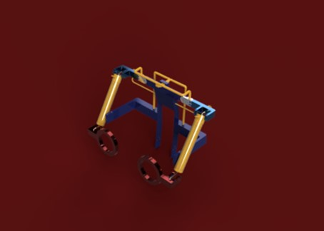

This project focuses on the development of a power-augmenting exo suit for use in arduous environments. The key concept used here is the reliance on multifilament mckibben muscles or fibers for the actuation  instead of the conventional servo or hydraulic actuators. 
The concept was then presented at the Second International Conference on Robotics, Intelligent Automation, and Control Technologies(RIACT 2021) and was awarded the Outstanding Oral Presentation Award at the Conference.
To see the individual fibre see [here](Fiber.stl). To see the construction of the external meshing please zoom in.

